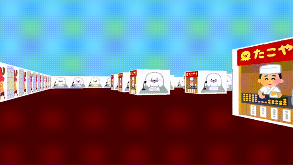

# cub3D

[English](README.md) | 日本語

[Wolfenstein 3D](https://en.wikipedia.org/wiki/Wolfenstein_3D) にインスパイアされた、レイキャスティングによる3D迷路レンダラーです。
[42 Tokyo](https://42tokyo.jp/) のカリキュラム課題として作成しました。

## デモ



## 概要

cub3D は `.cub` マップファイルで定義された迷路を一人称視点で描画します。[DDA（Digital Differential Analyzer）](https://lodev.org/cgtutor/raycasting.html)アルゴリズムを使用してレイを飛ばし、テクスチャ付きの壁を正しいパースペクティブで描画します。

### 機能

- テクスチャ付きのリアルタイムレイキャスティング
- XPM ファイルによる壁テクスチャの設定（東西南北）
- 床と天井の色のカスタマイズ
- W/A/S/D による移動、矢印キーによる視点回転
- マップのバリデーション（壁の閉塞チェック、不正文字検出、プレイヤー位置の検証）
- クロスプラットフォーム対応（Linux / macOS）

## セットアップ

### 必要環境

- `cc`（C99 対応の C コンパイラ）
- `make`
- Linux: X11 ライブラリ（`libXext`, `libX11`）
- macOS: Xcode Command Line Tools

### ビルド & 実行

MiniLibX グラフィックスライブラリはビルド時に自動でクローンされます:
- **macOS**: [minilibx_macos](https://github.com/ncoden/minilibx_macos.git)
- **Linux**: [minilibx-linux](https://github.com/42Paris/minilibx-linux.git)

```sh
make
./cub3d <マップファイル.cub>
```

例:

```sh
./cub3d map/valid/lodev.cub
```

### 操作方法

| キー | 操作 |
|------|------|
| `W` | 前進 |
| `S` | 後退 |
| `A` | 左に平行移動 |
| `D` | 右に平行移動 |
| `←` | 左に回転 |
| `→` | 右に回転 |
| `ESC` | 終了 |

## マップ形式

マップファイルは `.cub` 拡張子を使用します:

```
NO ./textures/north.xpm
SO ./textures/south.xpm
WE ./textures/west.xpm
EA ./textures/east.xpm

F 120,120,120
C 200,220,255

111111
1N0001
100001
100001
100001
111111
```

- `NO/SO/WE/EA` — 東西南北の壁テクスチャ
- `F` / `C` — 床 / 天井の RGB カラー
- マップ文字: `1` = 壁、`0` = 床、`N/S/E/W` = プレイヤーの初期位置と向き
- マップは壁で完全に囲まれている必要があります

## プロジェクト構成

```
.
├── main.c                  # エントリーポイント
├── cub3d.h                 # メインヘッダーとデータ構造体
├── srcs/
│   ├── parser.c            # マップファイルのパース
│   ├── check.c             # 設定値のバリデーション
│   ├── check_map.c         # マップの壁閉塞チェック
│   ├── find_player.c       # プレイヤー初期位置の検出
│   ├── init.c              # 初期化とテクスチャ読み込み
│   ├── cub3d.c             # コアのセットアップとクリーンアップ
│   ├── utils.c             # ユーティリティ関数
│   ├── debug.c             # デバッグ出力
│   ├── dda/
│   │   ├── dda.c           # レイキャスティング（DDAアルゴリズム）
│   │   ├── dda_utils.c     # ピクセル描画とレイの初期化
│   │   └── texture.c       # テクスチャ読み込みとピクセルサンプリング
│   └── hooks/
│       ├── hooks.c         # 描画ループとウィンドウイベント
│       └── key_hook.c      # キーボード入力とプレイヤー移動
├── libft/                  # 自作 C 標準ライブラリ
├── textures/               # XPM テクスチャファイル
└── map/
    ├── valid/              # 有効なテストマップ
    └── invalid/            # 無効なテストマップ
```

## 著者

- [Natsumi Teshima](https://github.com/Killua0615)
- [Yuki Wada](https://github.com/kitopito)
